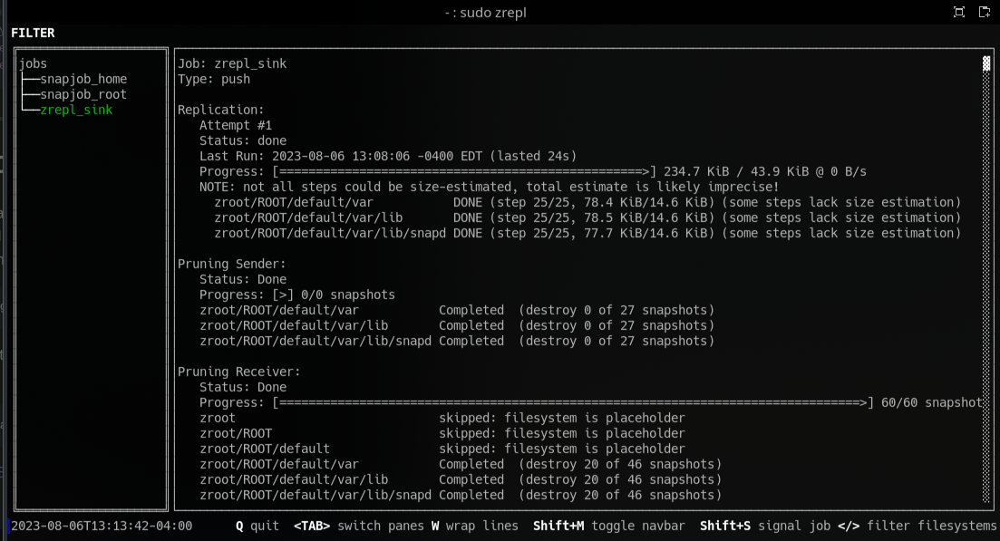

# Manual Client Push to Sink Server

This is an example configuration used on a client to connect to Sink Server daemon container via `tls` on demand. For simplicity *manual snapshotting* is used (meaning that some other `zrepl` job or some other method of creating a snapshot is assumed).

[Back to README.md](../README.md)

---

* Review full [manual push config](../examples/zrepl_push.yml) file described below
* Review how [tls certificates](./ca_using_easyrsa.md) were created for `zrepl` clients, the 3 needed files have been placed in `/etc/zrepl/` directory on each client.

1. The `jobs` section defines the `push` job on the client to connect to the Sink Server daemon:

    ```yaml
    - name: zrepl_sink
      type: push
      connect:
        type: tls
        address: 192.168.10.100:8448
        ca: /etc/zrepl/ca.crt
        cert: /etc/zrepl/dldsk01.crt
        key: /etc/zrepl/dldsk01.key
        server_cn: sink-srv
    ```

    * `address:` points to the IP or hostname of the Sink Server daemon and its port number
    * `ca:` is the pathname to the Certificate Authority certificate
    * `cert:` is the pathname to this clients certificate (has the `CN` attribute used to identify itself to the server)
    * `key:` is the pathname to this clients private key
    * `server_cn:` is the `CN` attribute value expected from the Sink Server daemon

2. Define `filesystems` filter for snapshots of datasets for replication to the Sink Server daemon
    * This test example only sends the client `/var/` directory and defines several excludes to *not* replicate
    * Adjust these for your needs, see `zrepl` project docs on [filesystem filtering](https://zrepl.github.io/v0.2.1/configuration/filter_syntax.html) for more details

    ```yaml
      filesystems: {
        "zroot/ROOT/default/var<" : true,
        "zroot/ROOT/default/var/cache<": false,
        "zroot/ROOT/default/var/lib/docker<": false,
        "zroot/ROOT/default/var/log<": false,
        "zroot/ROOT/default/var/tmp<": false,
      }
    ```

3. Review send options, see `zrepl` project docs on [Send Options](https://zrepl.github.io/stable/configuration/sendrecvoptions.html#job-send-options) for details
    * Example stated to send the encrypted datasets as [encrypted](https://zrepl.github.io/stable/configuration/sendrecvoptions.html#encrypted) and send dataset properties
    * *WARNING:* This can be dangerous on the Sink Server daemon host if not done properly, read and understand [zrepl project warnings]((https://zrepl.github.io/stable/configuration/sendrecvoptions.html#job-note-property-replication)) on this topic

    ```yaml
      send:
        encrypted: true
        send_properties: true
    ```

4. Review replication options, see `zrepl` project docs for [Replication Option](https://zrepl.github.io/stable/configuration/sendrecvoptions.html#job-recv-options-inherit-and-override) details

    * Instructs `zrepl` to guarantee that replication always resumable and that incremental replication will always be possible

    ```yaml
      replication:
        protection:
          initial: guarantee_resumability
          incremental: guarantee_incremental
    ```

5. Define snap type, see `zrepl` project docs for [Taking Snapshots](https://zrepl.github.io/stable/configuration/snapshotting.html)

    * For simplicity this example uses type `manual` meaning this job will not create any snapshots, they are being created by another job or some other process
    * NOTE: the setting `manual` makes this a *manual process*, selecting a different type will automate the Sink Replication each time snapshots are taken

    ```yaml
      snapshotting:
        type: manual
    ```

6. Define pruning policy, see `zrepl` project docs for [Pruning Policies](https://zrepl.github.io/stable/configuration/prune.html)

    * `keep_sender` in this example states to keep all snapshots on the sender side, as this is a `manual` snapshot then some other job or process will prune local snapshots
    * Under `keep_receiver` the `type: grid` defines how long replicated snapshots will be kept
      * The `grid` will apply to all snapshots beginning with `zrepl_`
    * Under `keep_receiver` the `type: regex` states to retain all snapshots *NOT* created by `zrepl`
      * *WARNING*: by default `zrepl` has no concept of ownership; it will process all snapshots regardless how they were created

    ```yaml
      pruning:
        # no-op prune rule on sender (keep all snapshots)
        keep_sender:
          - type: regex
            regex: ".*"
        keep_receiver:
          - type: grid
            grid: 1x1h(keep=all) | 24x1h | 30x1d | 12x30d
            regex: "^zrepl_.*"
          # retain all non-zrepl snapshots on the sink host
          - type: regex
            negate: true
            regex: "^zrepl_.*"
    ```

---

## Wakeup Job

This example is a manual process due to the *snapshot type* being set to `manual`. Manual process can be triggered on the client using the `zrepl` on the client using the `wakeup` signal to the specified `job`:

```shell
sudo zrepl signal wakeup zrepl_sink
```

You can monitor the replication process:

```shell
sudo zrepl status
```

Select the `zrepl_sink` job:



* As defined by this job, datasets matching the `fileystems` filter were replicated to the remote Sink Server daemon
* No snapshots on the local client were pruned
* Snapshots on the remote Sink Server were pruned based on the `grid` definition and based on when the previous manual `wakeup` was issues
  * Screenshot shows 20 snapshots had aged out of the grid since previous manual `wakeup`

[Back to README.md](../README.md)
