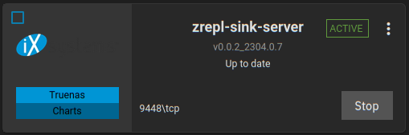
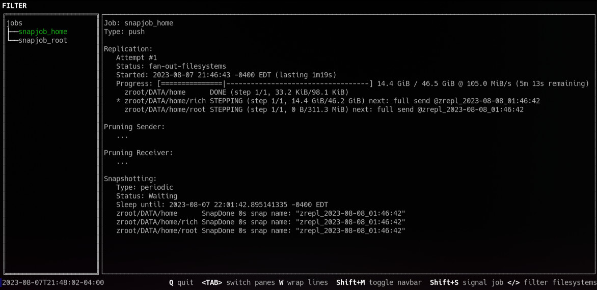

# zrepl Sink Server for TrueNAS Scale

[Zrepl Project Example on Sink Server](https://zrepl.github.io/quickstart/continuous_server_backup.html)

## Warning Message

* The zrepl_sink server container requires Privileged Mode enabled in order to access `/dev/zfs` and `/proc/self/mounts` which are required by `zrepl`.
  * These paths can not be specified by host path as the TrueNAS configuration wizard does not allow a path outside of the ZFS pool.
  * _Potentially Zrepl can be run with an unprivileged user in combination with ZFS delegation._

[Back to README.md](./README.md)

---

## Known Issues

* If after rebooting, TrueNAS is unable to start Docker or Kubernetes applications with a message that `Datasets are locked`.
  * `locked` in this context does not appear to be related to encrypted datasets with keys unavailable - which is the usual "locked data" in TrueNAS.
  * The datasets are mounted and browsable however the zrepl dataset being unrelated to other applications still prevents them from starting.
  * `zrepl` project documentation has warnings about enabling [ZFS property replication](https://zrepl.github.io/configuration/sendrecvoptions.html#a-note-on-property-replication).

Tested the following ZFS receive property overrides (did not help):

```text
  recv:
    properties:
      override: {
        "canmount": "off",
        "mountpoint": "none",
        "readonly": "on",
        "openzfs.systemd:ignore": "on"
      }
```

To recover and be able to start Docker / Kubernetes application on TrueNAS the zrepl sink dataset had to be destroyed (which requires holds on datasets to be [removed manually](destroy_zrepl_datasets.md)).

---

## Configuration

### Create Datasets

Create two datasets one to hold replication datasets from all the zrepl clients and the other to hold the Zrepl Sink Server configuration. Steps below assumes ZFS zpool named `main`

1. Create dataset in TrueNAS for Zrepl Sink Server Data:

    * Name & Location: `main/zrepl_sink_data`
    * Comment: "Zrepl Sink Server Daemon data"

    Manually set the following properties on the dataset from TrueNAS CLI:

    ```shell
    zfs set canmount=off main/zrepl_sink_data
    zfs set mountpoint=none main/zrepl_sink_data
    zfs set readonly=on main/zrepl_sink_data
    ```

2. Create dataset in TrueNAS for Zrepl Sink Server Configuration:

    * Name & Location: `main/apps/zrepl_sink`
    * Comment: "Zrepl Sink Server Daemon configuration"

### Configure Zrepl Sink Server

1. Add Sink Server TLS Certificates to `main/apps/zrepl_sink`.

    * Certificate Authority certificate: `ca.crt`
    * Sink Server Certificate: `sink-srv.crt`
    * Sink Server Private Key: `sink-srv.key`

    ```shell
    cd /mnt/main/apps/zrepl_sink

    ~ chmod 600 ca.crt
    ~ chmod 600 sink-srv.key
    ~ ls -l

    -rw------- 1 root root 1204 Aug  7 15:07 ca.crt
    -rw-r--r-- 1 root root 4665 Aug  7 15:08 sink-srv.crt
    -rw------- 1 root root 1704 Aug  7 15:09 sink-srv.key
    ```

2. Add Sink Server YAML Configuration file:

    * Path: `/mnt/main/apps/zrepl_sink/zrepl.yml`
    * View [example configuration](../examples/zrepl_sink.yml) file.

3. The following `recv` properties are currently suggested on `sink` job side:

    ```text
      recv:
        properties:
          # Force mountpoint to be inherited from Sink container (set to none)
          inherit:
            - "mountpoint"
          override: {
            # These two need to be disabled to support ZVOL replication
            # "canmount": "off",
            # "mountpoint": "none"
            "readonly": "on",
            "openzfs.systemd:ignore": "on"
            }
    ```

    * In conjunction with clients being set to:

    ```text
      send:
        encrypted: true
        send_properties: false
    ```

    * Setting `send_properties: false` has allowed zrepl sink jobs to work correctly with the Zrepl Sink Server deployed to TrueNAS.
    * Obviously enable encryption only if your ZFS configuration is setup to use it.

### Configure Docker Image from TrueNAS GUI

1. Apps > click [`Launch Docker Image`]

    * Application Name: zrepl-sink-server
    * Container Image: `quay.io/reefland/zrepl_sink`
    * Image Tag: `latest`
    * Image Pull Policy: `Only pull image if not present`

    Configure Port Forwarding:
    * Click [`Add`]
      * Container Port: `9448`
      * Node Port: `9448`
      * Protocol: `TCP Protocol`
    * Click [`Add`]
      * Container Port: `9811`
      * Node Port: `9811`
      * Protocol: `TCP Protocol`

    Configure Storage - Host Path Volumes:
    * Click [`Add`]
      * Host Path: `/mnt/main/apps/zrepl_sink`
      * Mount Path: `/config`
      * Read Only: `Enable`

    Security Context:
    * Privileged Mode: `Enabled`

2. Click [`Save`]

    In a few moments application should become `Active`:

    

3. Review Sink Server Container Logs:

    * Click the triple-dots and select logs, click [`Choose`]:

    ```text
    2023-08-07 19:33:37.835744+00:00* Default Config File Set: /config/zrepl.yml
    2023-08-07 19:33:37.835830+00:00* Config location verified.
    2023-08-07 19:33:37.838685+00:00* root_fs value for sink pool: main/zrepl_sink_data
    2023-08-07 19:33:37.838727+00:002023-08-07T19:33:37.838727418Z
    2023-08-07 19:33:37.855706+00:00NAME                   USED  AVAIL     REFER  MOUNTPOINT
    2023-08-07 19:33:37.855750+00:00main/apps/zrepl_sink   472K  21.5T      200K  /mnt/main/apps/zrepl_sink
    2023-08-07 19:33:37.855958+00:002023-08-07T19:33:37.855958131Z
    2023-08-07 19:33:37.855968+00:00Attempting zrepl config check...
    2023-08-07 19:33:38.084655+00:00Attempting to start zrepl daemon...
    2023-08-07 19:33:38.089839+00:002023-08-07T19:33:38Z [INFO]: zrepl version=v0.6.0 go=go1.19.2 GOOS=linux GOARCH=amd64 Compiler=gc
    2023-08-07 19:33:38.089956+00:002023-08-07T19:33:38Z [INFO]: starting daemon
    2023-08-07 19:33:38.089959+00:002023-08-07T19:33:38Z [INFO][_control][job][Uv38$Uv38]: starting job
    2023-08-07 19:33:38.090006+00:002023-08-07T19:33:38Z [INFO][zrepl_sink_server][job][Uv38$Uv38]: starting job
    ```

---

## Check Client Connection

From a computer running Zrepl Push Job to Sink Server:

```shell
sudo zrepl status
```

Client should make TLS connection to Sink Server and start replication process:



---

[Back to README.md](./README.md)
